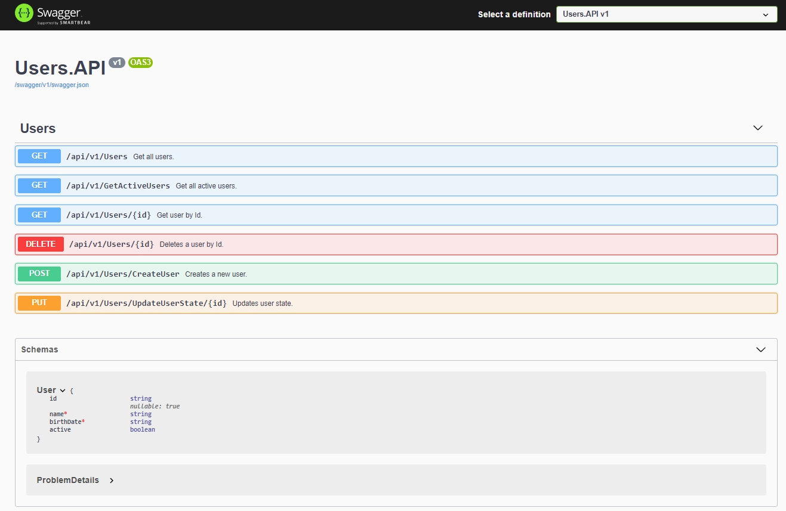

# User Management Service API

- ASP.NET Core Web API
- Framework .Net 5.0
- REST API documented using Swagger
- Microservices architecture
- Docker
- MongoDB
- Unit Tests using xUnit

	

## Run

With **Docker Desktop** running, debug using `docker-compose` to create the container and access `http://localhost:8000/swagger/index.html` to see the screen above.